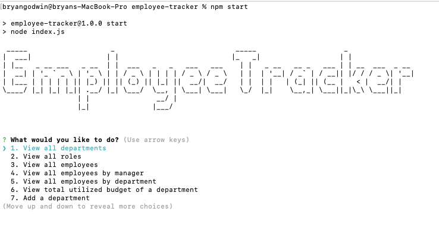
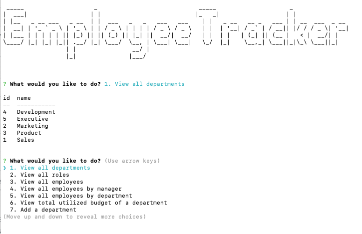
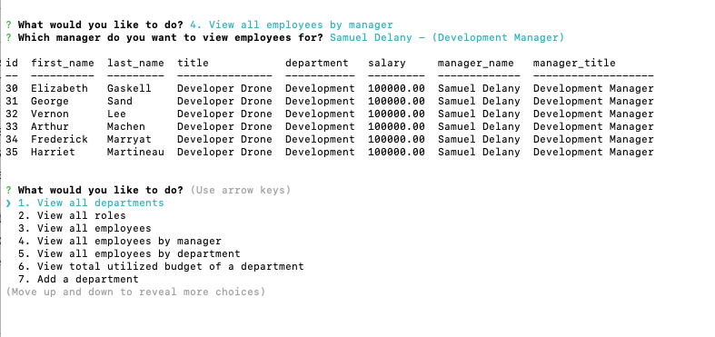

# **Bryan Godwin - Week 12 Challenge**

## **Employee Tracker**

### This challenge is to create a command line interface to manage a company's employee database using Node.js, Inquirer, and MySQL.

### **User Story**

    AS A business owner
    I WANT to be able to view and manage the departments, roles, and employees in my company
    SO THAT I can organize and plan my business

### **Acceptance Critera**

1.  User can view all departments

        WHEN I choose to view all departments
        THEN I am presented with a formatted table showing department names and department ids

2.  User can view all roles

        WHEN I choose to view all roles
        THEN I am presented with the job title, role id, the department that role belongs to, and the salary for that role

3.  User can view all employees

        WHEN I choose to view all employees
        THEN I am presented with a formatted table showing employee data, including employee ids, first names, last names, job titles, departments, salaries, and managers that the employees report to

4.  User can add a department

        WHEN I choose to add a department
        THEN I am prompted to enter the name of the department and that department is added to the database

5.  User can add a role

        WHEN I choose to add a role
        THEN I am prompted to enter the name, salary, and department for the role and that role is added to the database

6.  User can add an employee

        WHEN I choose to add an employee
        THEN I am prompted to enter the employee’s first name, last name, role, and manager and that employee is added to the database

7.  User can add update an employee

        WHEN I choose to update an employee role
        THEN I am prompted to select an employee to update and their new role and this information is updated in the database

### **Development Notes**

This project implements all BONUS functionality

- Update employee managers.

- View employees by manager.

- View employees by department.

- Delete departments, roles, and employees.

- View the total utilized budget (combined salaries of all employees) of a department.

### **Challenge 12 - code repository**

<https://github.com/godwinbw/employee-tracker>

### **Challenge 12 - screenshots**

### \*\*Challenge 12 - link to walkthrough video

<https://streamable.com/0lnrdx>
